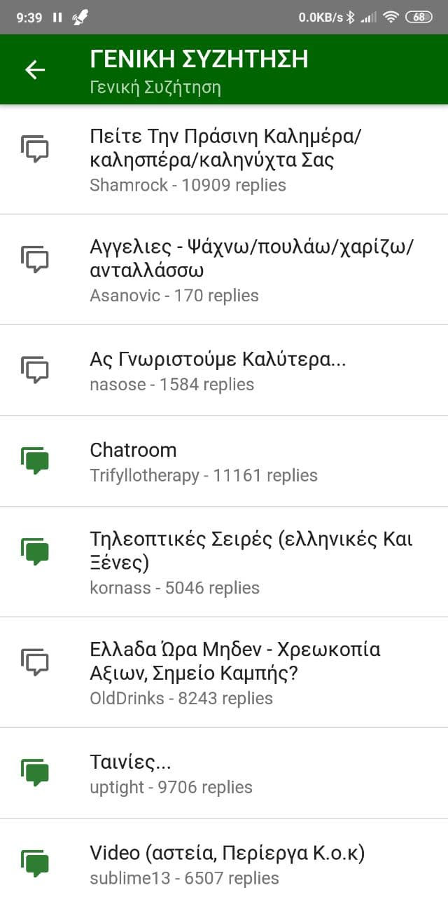
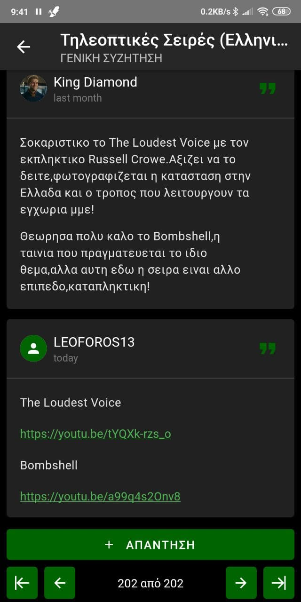

# phpbb-to-rn

A React Native app that scrapes and displays data from an old-school phpbb forum

## Screenshots

A comparison between between the original old and unresponsive website, and the react native app.

Some extra screenshots. The third one showcases the dark theme.

  
  
  
  
  

